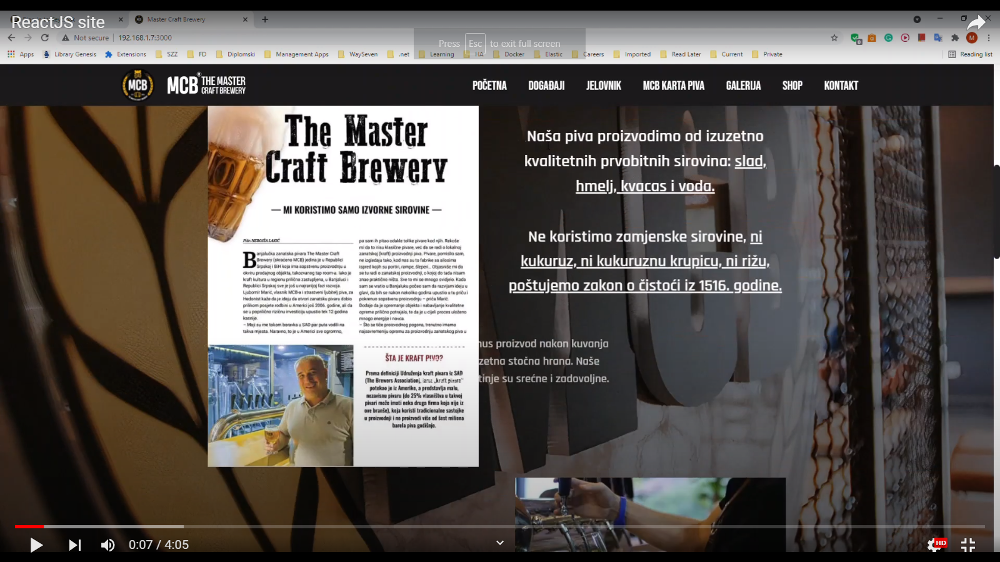

# Master Craft Brewery
--------------

Project developed for educational purposes. It is a three-layered web application, implemented using:
- MySQL  
-  ASP.NET Core  
- ReactJS  
- Keycloak  

Video demonstrating some of the features is shown below.  
.  
## Features
---------------
MasterCraftBrewery is a software solution developed to organize work of catering-business object The Master Craft Brewery. The primary goal is to serve marketing and promotion of the object and events in this object via Web presentation. It is divided into public Web presentation and administration part available to registered administrators.
Web presentation has a purpose to show (in an attractive way) services that the company offers, like the food menu, beer map, online ordering, events that the company organizes...
The administration part of the system enables registered administrators of the company to change the content of Web presentation simply and intuitively, to confirm orders, and add new administrators.

### Back-end
Business logic and data manipulation are contained in the back-end part of the application. 
As a database, MySQL is used, combined with Entity Framework Core as Data Access Layer(code first principle). Navigational properties are something new that I use, compared to previous projects, where I haven't used them a lot.  Automapper is something that I consistently use in my projects (or MapStruct in Java) because the code for mapping classes is easily maintainable. I use it to map entities to DTOs and JSON wrapper classes to DTOs. Rest controllers are lightweight, and most of the logic is contained in classes I named managers in Core project. Using dependency injection, the creation of objects is moved to one place and can be easily changed and adapted. Here, I used Microsoft Dependency Injection, and if you want to see how Autofac is configured, check this project - [Orhedge](https://github.com/chimarry/Orhedge). You can see how some of the new features of C# 8 are used here, like IAsyncEnumerable. One of the favorite things configured in this project is the use of .NET authentication and authorization middlewares. Authentication is only done via API key because the Web presentation is public. Administrators are authorized by using JWT token policy and Keycloak. If you want to know more about configuring the Keycloak server, contact me via gmail: marija.vanja.novakovic@gmail.com. If you want to see a more complex authentication flow, check this project - [Chat Application](https://github.com/chimarry/ChatApplication). 

### Front-end
ReactJS is used to build the front-end part of the system. Libraries that are worth mentioning are keycloak-js, Bootstrap (reactstrap), and Material UI (we used both for educational purposes). 
